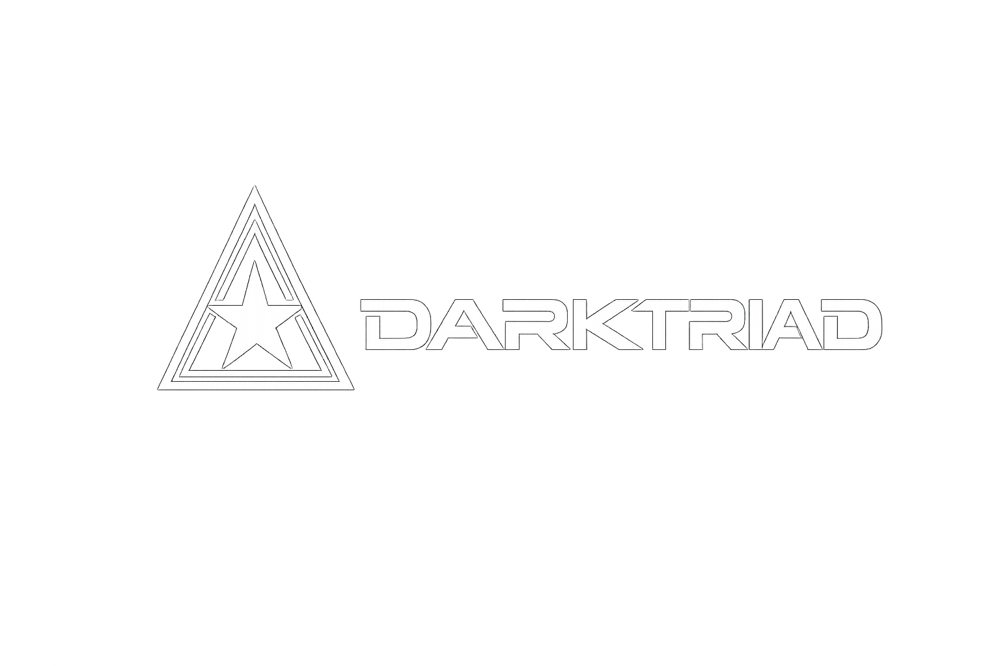
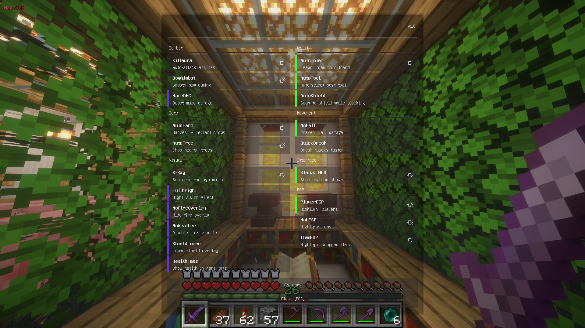
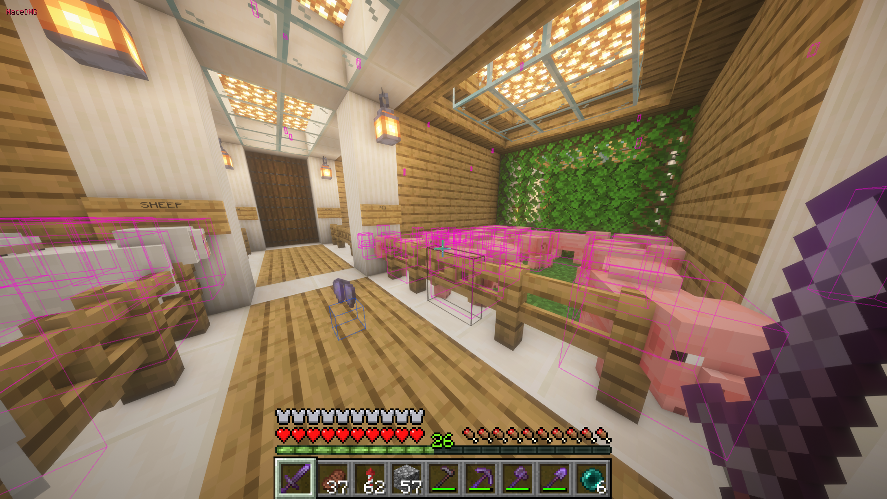
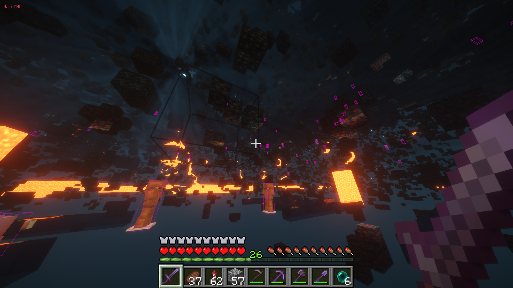
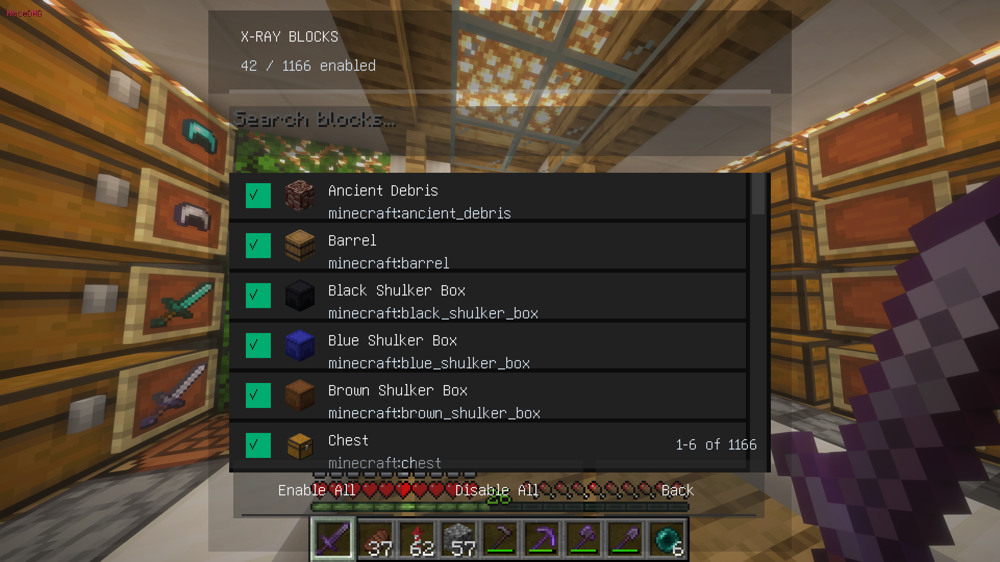
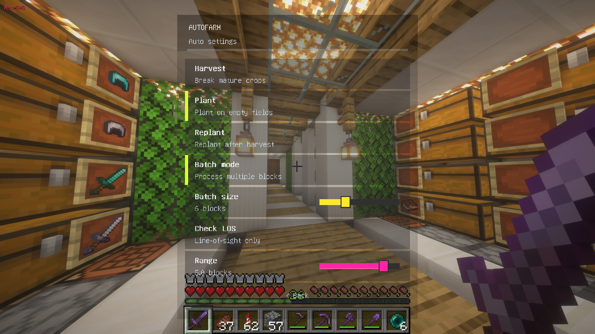
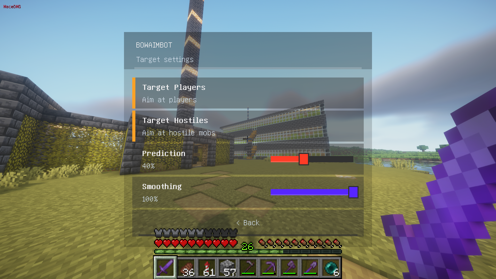
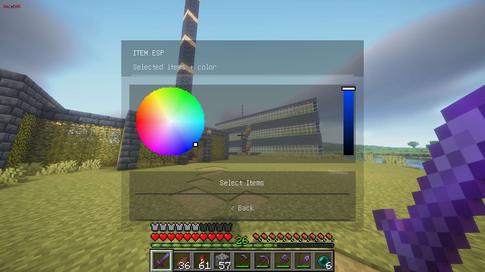
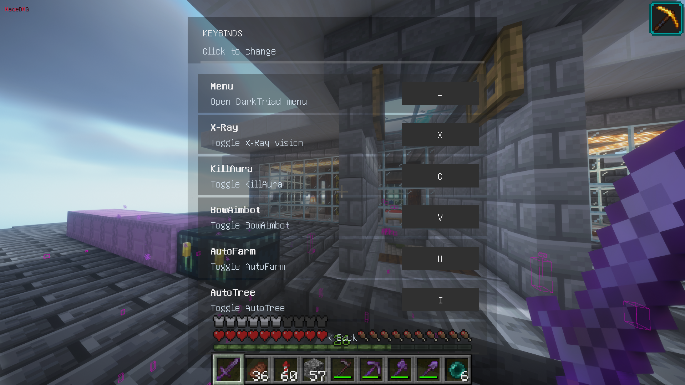

# DarkTriad

DarkTriad is a private-use Minecraft Fabric client mod for 1.21.10.

## Requirements
- Minecraft 1.21.10
- Java 21
- Fabric Loader 0.18.4+
- Fabric API 0.138.4+1.21.10

## Install (Client)
1) Install Fabric Loader for 1.21.10.
2) Download Fabric API `0.138.4+1.21.10` from: https://modrinth.com/mod/fabric-api/version/0.138.4+1.21.10
3) Download `darktriad-1.0.0.jar` from: https://github.com/OmgDezzz/DarkTriad/raw/main/darktriad-1.0.0.jar
4) Place both jars into your `.minecraft/mods` folder.
5) Launch Minecraft using the Fabric profile.

## Default Keybinds
- Open menu: `=`
- X-ray: `X`
- KillAura: `C`
- BowAimbot: `V`
- AutoFarm: `U`
- AutoTree: `I`

Keybinds are configurable in the in-game menu.

## Features (Client-Side)
### Combat
- KillAura: Auto-attacks nearby entities with range and target filters, respects attack cooldown.
- BowAimbot (experimental): Smooths bow aiming toward a target; has prediction and smoothing sliders. Still being optimized.
- AutoTotem: Auto-swaps a totem to offhand at low health.
- AutoShield: Auto-swaps to a shield while holding right click.

### Vision / Rendering
- X-ray (Sodium compatible): Hides non-ore blocks and highlights ores/containers; works with Sodium.
- Fullbright: Night-vision based brightness that works with shaders/Sodium.
- ESP: Player, mob, and item ESP overlays.
- HealthTags: Wurst-style health numbers over entities.
- NoFireOverlay: Removes the fire overlay.
- NoWeather: Disables rain visuals.
- ShieldLower: Lowers the shield overlay.

### Movement / World
- QuickBreak: Client-side block breaking speed multiplier.
- NoFall: Basic no-fall toggle (client-side movement).
- MaceDMG: Damage boost toggle for the mace.

### Bots / Automation
- AutoFarm: Harvest + replant with a simple target selection system.
- AutoTree (experimental): Searches for trees, walks toward them, chops logs, and attempts to pick up drops. Work in progress; pathing and pickup are still being refined.

### UI / UX
- Modern GUI with toggles and per-feature config screens.
- Config persistence in `config/darktriad.json`.
- Status HUD showing enabled features (with category filters).

## Notes
- This mod is intended for private servers with consent.
- Config file: `config/darktriad.json`
- This project was made with the collaboration of AI, including Codex and Anthropic's Claude Code.

## Media
### Menu UI

### ESP

### X-ray

### X-ray Block Selection

### AutoFarm Settings

### BowAimbot Settings

### Item ESP Settings

### Keybinds

## License
All rights reserved. See `LICENSE`.
